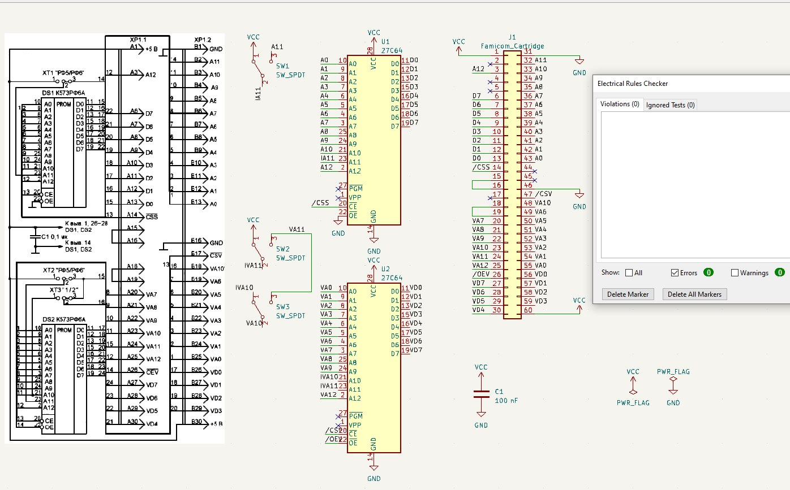
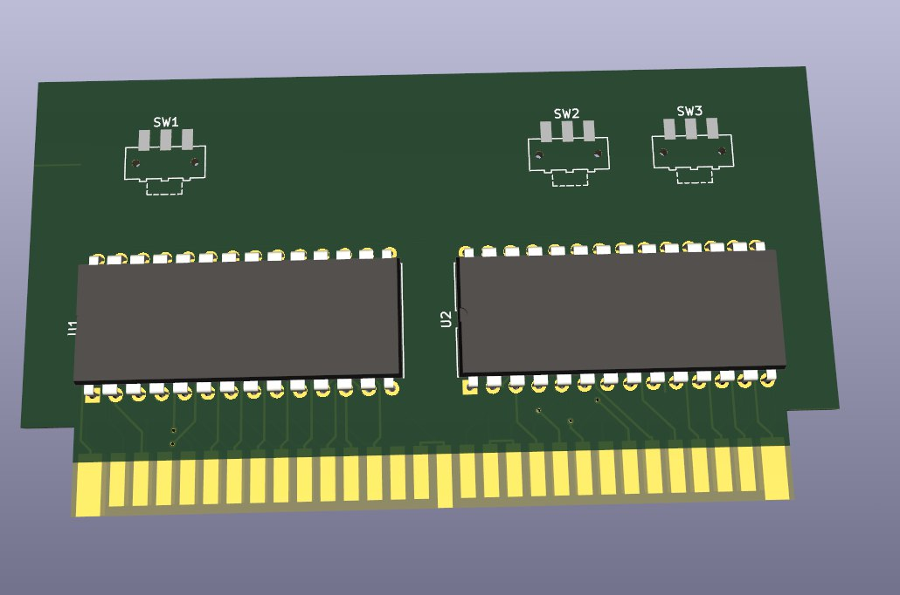

# Fami_GITS2
GITS2 board for Famicom. Generates test patterns for the screen.

## Based on GITS2 project
[GITS2 Project](https://qrx.narod.ru/izm/g_its.htm)

[GITS2 ROMs](https://ftp.radio.ru/pub/2002/10/gits2/)

# Board renders
Schematic completed and DRC is OK

The PCB is work in progress, here a current render:

## Famicom cartridge
Using HVC-TGROM-01 